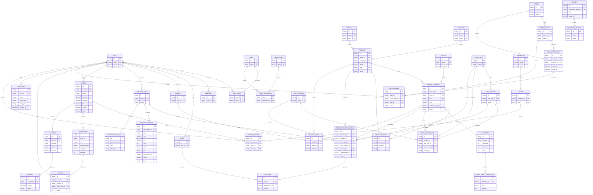

@'

# Eyewear Platform — Database ERD

```mermaid
erDiagram

    USER ||--o{ USER_ROLE : has
    ROLE ||--o{ USER_ROLE : assigned
    ROLE ||--o{ ROLE_PERMISSION : grants
    PERMISSION ||--o{ ROLE_PERMISSION : contains

    USER ||--o{ ADDRESS : owns
    USER ||--o| CART : has
    USER ||--o| WISHLIST : has
    USER ||--o{ PRESCRIPTION : creates
    USER ||--o{ ORDER : places
    USER ||--o{ REVIEW : writes
    USER ||--o{ APPOINTMENT : books
    USER ||--o{ AUDIT_LOG : creates

    BRAND ||--o{ PRODUCT : owns
    CATEGORY ||--o{ PRODUCT : contains
    COLOR ||--o{ PRODUCT_VARIANT : defines

    PRODUCT ||--o{ PRODUCT_VARIANT : has
    PRODUCT ||--o{ PRODUCT_IMAGE : has
    PRODUCT_VARIANT ||--o{ PRODUCT_IMAGE : has

    PRODUCT_VARIANT ||--|| INVENTORY : has
    INVENTORY ||--o{ INVENTORY_TRANSACTION : records

    LENS_TYPE ||--o{ LENS_VARIANT : offers
    LENS_VARIANT ||--o{ LENS_COMPATIBILITY : supports
    LENS_TYPE ||--o{ LENS_COMPATIBILITY : supports
    LENS_COATING ||--o{ LENS_COMPATIBILITY : supports
    PRODUCT_VARIANT ||--o{ LENS_COMPATIBILITY : permits

    PRODUCT ||--o{ PRODUCT_CONFIGURATION : configures
    PRODUCT_VARIANT ||--o{ PRODUCT_CONFIGURATION : configures
    LENS_TYPE ||--o{ PRODUCT_CONFIGURATION : selects
    LENS_VARIANT ||--o{ PRODUCT_CONFIGURATION : selects
    LENS_COATING ||--o{ PRODUCT_CONFIGURATION : selects
    PRESCRIPTION ||--o{ PRODUCT_CONFIGURATION : uses

    PRESCRIPTION ||--o{ PRESCRIPTION_EYE : contains
    PRESCRIPTION ||--o{ PRESCRIPTION_FILE : contains

    CART ||--o{ CART_ITEM : contains
    PRODUCT_CONFIGURATION ||--o{ CART_ITEM : represents

    WISHLIST ||--o{ WISHLIST_ITEM : contains
    PRODUCT ||--o{ WISHLIST_ITEM : saved
    PRODUCT_VARIANT ||--o{ WISHLIST_ITEM : saved

    PROMOTION ||--o{ COUPON : defines
    COUPON ||--o{ COUPON_USAGE : tracks
    USER ||--o{ COUPON_USAGE : redeems
    ORDER ||--o{ COUPON_USAGE : applies

    STORE ||--o{ STORE_SERVICE : offers
    STORE ||--o{ APPOINTMENT_SLOT : provides
    STORE_SERVICE ||--o{ APPOINTMENT_SLOT : schedules
    STORE_SERVICE ||--o{ APPOINTMENT : books
    APPOINTMENT_SLOT ||--o{ APPOINTMENT : contains

    ORDER ||--o{ ORDER_ITEM : contains
    ORDER ||--o{ PAYMENT : receives
    PAYMENT ||--o{ REFUND : produces
    ORDER_ITEM ||--o{ REVIEW : reviewed

    BANNER }o--|| HOMEPAGE_SECTION : belongs

    USER {
        string id PK
        string email UK
        string phone UK
    }

    ROLE {
        string id PK
        string name UK
    }

    PERMISSION {
        string id PK
        string name UK
    }

    USER_ROLE {
        string user_id FK
        string role_id FK
    }

    ROLE_PERMISSION {
        string role_id FK
        string permission_id FK
    }

    ADDRESS {
        string id PK
        string user_id FK
    }

    BRAND {
        string id PK
        string name UK
        string slug UK
    }

    CATEGORY {
        string id PK
        string name
        string slug UK
    }

    COLOR {
        string id PK
        string name UK
        string hex_code
    }

    PRODUCT {
        string id PK
        string brand_id FK
        string category_id FK
        string name
        string slug UK
        string status
    }

    PRODUCT_VARIANT {
        string id PK
        string product_id FK
        string color_id FK
        string sku UK
        decimal price
        decimal compare_at_price
        string status
    }

    PRODUCT_IMAGE {
        string id PK
        string product_id FK
        string variant_id FK
        string url
    }

    INVENTORY {
        string id PK
        string variant_id FK
        int available
        int reserved
        int sold
    }

    INVENTORY_TRANSACTION {
        string id PK
        string inventory_id FK
        string type
        int quantity
    }

    LENS_TYPE {
        string id PK
        string name UK
    }

    LENS_VARIANT {
        string id PK
        string lens_type_id FK
        string name
    }

    LENS_COATING {
        string id PK
        string name UK
    }

    LENS_COMPATIBILITY {
        string id PK
        string variant_id FK
        string lens_type_id FK
        string lens_variant_id FK
        string coating_id FK
    }

    PRODUCT_CONFIGURATION {
        string id PK
        string product_id FK
        string variant_id FK
        string lens_type_id FK
        string lens_variant_id FK
        string coating_id FK
        string prescription_id FK
        string status
    }

    PRESCRIPTION {
        string id PK
        string user_id FK
        string source
    }

    PRESCRIPTION_EYE {
        string id PK
        string prescription_id FK
        string eye
        decimal sph
        decimal cyl
        int axis
        decimal add
        decimal pd
        decimal monocular_pd
        decimal prism
        string base
    }

    PRESCRIPTION_FILE {
        string id PK
        string prescription_id FK
        string url
        string file_type
    }

    CART {
        string id PK
        string user_id FK
    }

    CART_ITEM {
        string id PK
        string cart_id FK
        string configuration_id FK
        int quantity
    }

    WISHLIST {
        string id PK
        string user_id FK
    }

    WISHLIST_ITEM {
        string id PK
        string wishlist_id FK
        string product_id FK
        string variant_id FK
    }

    PROMOTION {
        string id PK
        string name
        string status
    }

    COUPON {
        string id PK
        string promotion_id FK
        string code UK
    }

    COUPON_USAGE {
        string id PK
        string coupon_id FK
        string user_id FK
        string order_id FK
    }

    STORE {
        string id PK
        string name
        string status
    }

    STORE_SERVICE {
        string id PK
        string store_id FK
        string name
    }

    APPOINTMENT_SLOT {
        string id PK
        string store_id FK
        string service_id FK
        datetime starts_at
        datetime ends_at
    }

    APPOINTMENT {
        string id PK
        string user_id FK
        string store_service_id FK
        string slot_id FK
        string status
    }

    ORDER {
        string id PK
        string user_id FK
        string status
        decimal subtotal
        decimal discount
        decimal tax
        decimal shipping
        decimal total
    }

    ORDER_ITEM {
        string id PK
        string order_id FK
        string sku
        string product_name
        decimal unit_price
        int quantity
    }

    PAYMENT {
        string id PK
        string order_id FK
        string provider
        string status
        decimal amount
    }

    REFUND {
        string id PK
        string payment_id FK
        decimal amount
        string status
    }

    REVIEW {
        string id PK
        string user_id FK
        string product_id FK
        string order_item_id FK
        int rating
    }

    BANNER {
        string id PK
        string homepage_section_id FK
        string title
        string image_url
    }

    HOMEPAGE_SECTION {
        string id PK
        string name
        string status
    }

    AUDIT_LOG {
        string id PK
        string user_id FK
        string action
        string entity_type
        string entity_id
        datetime created_at
    }
```
